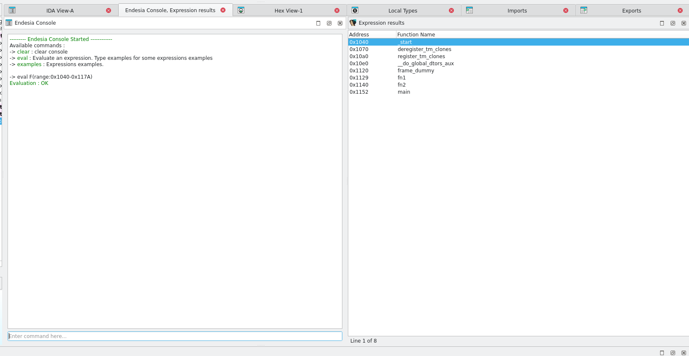

# Endesia

Endesia is a interactive console in IDA with expression evaluation support. 
The goal is to provide expression that can be evaluated to sort/manage IDA binaries. 

Additional Functionnalities:
 - Console support previous commands with Key-UP event. Temporary history (/tmp/.endesia.history)
 - AutoCompletion
 - Highlight Instruction when matching attributes

Can be Launched with Shift+F2 or with Edit->plugins->endesia

## Installation

Copy `libendesia` and `endesia-plugin.py` in IDAPRO plugins folder or `python3 install.py`

## Format

all expressions must start with: 

`eval PRIMARY_PARAMETERS(OPT_PARAMS:VALUE OPT_PARAMS2:VALUE) PRIMARY_PARAMETERS2(...)`

## Functions

Will create a windows with a list of functions

`eval PARAM=VALUE[OPERATOR]PARAM2=VALUE2`

available operators: `&` and `|` (and/or)

> There is no parentheis order -> operators are from left to right. ie `a1&a2|a3`-> `((a1 and a2) or a3)

available parameters:
    - section : filter by section 
    - range : filter by range (range:0xAAAA-0xBBBB)
    - param : filter by number of parameters
    - xor/add/sub... (xor/mov/add/sub/mul/div/shift left/shift right) : filter by instructions OPERATION constant
    - block : filter by number of blocks in flowgraph

each attributes have common descriptors : `>` | `<` | `=` | `!=` | `>=` | `<=`

Example : 

- `eval section=.text` will evaluate all functions from .text and list them
- `eval param=5` will evaluate all functions with 5parameters in functions signature
- `eval xor=0xff01` will evaluate all functions with a xor X, 0xff01 instructions

The same attributes can be used twice. ie : `eval xor_cst=0x41&xor=0x42`-> match all functions with xor X, 0x41 instructions AND xor X,0x42

With parameters , we can create complex query to fast sort functions.
For example, we are searching for a stripped checksum function.  
We know the function use 2 parameters (input value, size) and the function initialise 2 constant : 0xffff and 0xA001
We also know there is loop in the function so there is at least 3 blocks 

We can create query : `eval section=.text&param=2&mov=0xa001&block>=3` -> We found our function pretty fast

Search a crypto function:
`eval section=.text&xor=0xffaabbcc|xor=0xffaabbdd`-> search for a function in .text that have a xor const with 0xffaabbcc OR 0xffaabbdd 

## commands 

- help : show helps 
- examples : show some eval examples
- clear : clear terminal
- sections : list binary sections
- eval_list : list all attributes for expressions
- uncolor : Remove all generated color created by matching instructions const

## BUGS & SUPPORT

for now, this program has been tested on armv7 and x86. feel free to pull req/create an issue

