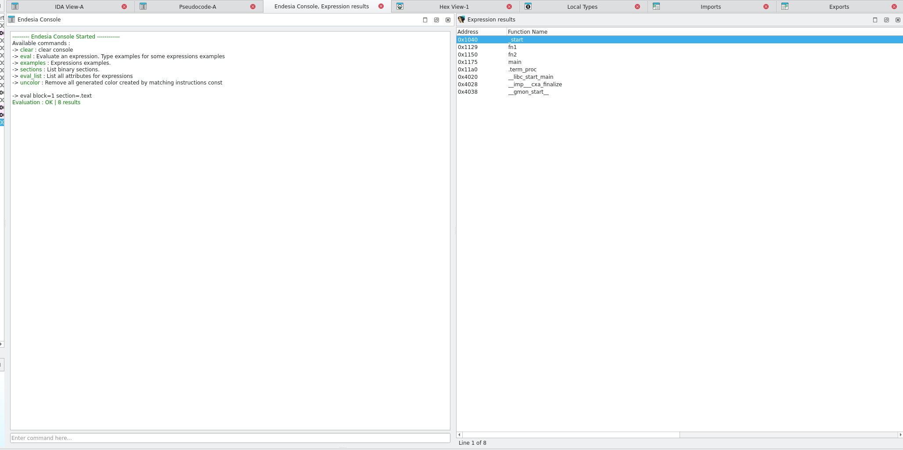

# Endesia

Endesia is a interactive console in IDA with expression evaluation support. 
The goal is to provide expression that can be evaluated to sort/manage IDA binaries. 

Console support previous commands with Key-UP event.

Can be Launched with Shift+F2 or with Edit->plugins->endesia

## Installation

Copy `libendesia` and `endesia-plugin.py` in IDAPRO plugins folder or `python3 install.py`

## Format

all expressions must start with: 

`eval PRIMARY_PARAMETERS(OPT_PARAMS:VALUE OPT_PARAMS2:VALUE) PRIMARY_PARAMETERS2(...)`

## Functions

Will create a windows with a list of functions

`eval F(...)`

available optionnals parameters:
    - section : filter by section 
    - range : filter by range (range:0xAAAA-0xBBBB)
    - params : filter by number of parameters

Example : 

- `eval F(section:.text)` will evaluate all functions from .text and list them
- `eval F(range:0x40000-0x400ab params:5)` will evaluate all functions in range [0x40000-0x400ab] and with 5parameters

